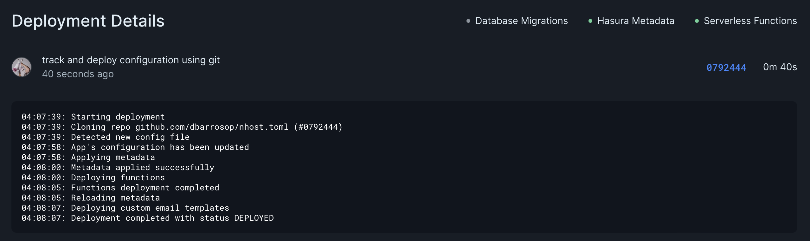

# Migrating Exising Project

To migrate an existing project you will need to do a few things:

1. Pull current configuration and secrets
2. Extract sensitive information
3. Push new configuration

First, we are going to run `nhost config pull` to get the configuration file and generate a stock `.secrets` file:

```
$ nhost config pull
> Successfully generated config and secrets file
```

Now let's take a look at the configuration file:

```toml
$cat nhost/nhost.toml

[global]
[[global.environment]]
name = 'GREET_PLAIN'
value = 'Sayonara'

[[global.environment]]
name = 'GREET_TYPE'
value = 'Hej'

[hasura]
version = 'v2.15.2'
adminSecret = "'ZAdx)h=Sy-YbsUfo:9ntz;3#;2p%A+L"
webhookSecret = '4vlO)+FvoG9pxz(6)H:H!obHFM*@L,TQ'

[[hasura.jwtSecrets]]
key = "u3u1EAR7OMQKsv;kh!sXm'm;lWnSuFE!0%QNSiZrs6z7N+_n9=$vgvul4tCma$KSzknVU7mmQ2KKAa3k+$9t*5&_j)qndke4;^mEM03jUsTFV)cl8nbJ!S;fBaMm*CQK"

[hasura.settings]
enableRemoteSchemaPermissions = false

[functions]
[functions.node]
version = 16

[auth]
version = '0.19.1'
...
```

And now the `.secrets` file:

```
$ cat .secrets
$
```

Ok, so what happened here? Our project isn't making use of secrets, instead all of the values are embedded into the configuration, let's fix it.

Note: Do not worry if your sensitive information is stored alongside your configuration in our systems, all parameters are stored safely and fully encrypted. The only real concern is pushing sensitive information to git.

## Extracting sensitive information from the configuration

Now we need to identify our sensitive information and store it in secrets so we can push the configuration to git. Looking at the configuration we can identify the following sensitive information:

``` toml
[[global.environment]]
name = 'GREET_TYPE'
value = 'Hej'

[hasura]
adminSecret = "'ZAdx)h=Sy-YbsUfo:9ntz;3#;2p%A+L"
webhookSecret = '4vlO)+FvoG9pxz(6)H:H!obHFM*@L,TQ'

[[hasura.jwtSecrets]]
key = "u3u1EAR7OMQKsv;kh!sXm'm;lWnSuFE!0%QNSiZrs6z7N+_n9=$vgvul4tCma$KSzknVU7mmQ2KKAa3k+$9t*5&_j)qndke4;^mEM03jUsTFV)cl8nbJ!S;fBaMm*CQK"
```

So the first thing we are going to do is create secrets for them:

```
$ nhost secrets create GREET_TYPE Hej
Secret 'GREET_TYPE' created successfully

$ nhost secrets create HASURA_GRAPHQL_ADMIN_SECRET "'ZAdx)h=Sy-YbsUfo:9ntz;3#;2p%A+L"
Secret 'HASURA_GRAPHQL_ADMIN_SECRET' created successfully

$ nhost secrets create NHOST_WEBHOOK_SECRET '4vlO)+FvoG9pxz(6)H:H!obHFM*@L,TQ'
Secret 'NHOST_WEBHOOK_SECRET' created successfully

$ nhost secrets create HASURA_GRAPHQL_JWT_SECRET "u3u1EAR7OMQKsv;kh\!sXm'm;lWnSuFE\!0%QNSiZrs6z7N+_n9=\$vgvul4tCma\$KSzknVU7mmQ2KKAa3k+\$9t*5&_j)qndke4;^mEM03jUsTFV)cl8nbJ\!S;fBaMm*CQK"
Secret 'HASURA_GRAPHQL_JWT_SECRET' created successfully
```

Alternatively, head to `https://app.nhost.io/$workspace/$project/settings/secrets` and use the dashboard to create the secrets.

Now we can replace the values in the configuration with the secrets:

```toml
[global]
[[global.environment]]
name = 'GREET_PLAIN'
value = 'Sayonara'

[[global.environment]]
name = 'GREET_TYPE'
value = '{{ secrets.GREET_TYPE }}'

[hasura]
version = 'v2.15.2'
adminSecret = '{{ secrets.HASURA_GRAPHQL_ADMIN_SECRET }}'
webhookSecret = '{{ secrets.NHOST_WEBHOOK_SECRET }}'

[[hasura.jwtSecrets]]
type = 'HS256'
key = '{{ secrets.HASURA_GRAPHQL_JWT_SECRET }}'
```

We can now verify we have the secrets in the cloud with:

```
$ nhost secrets list
The following secrets are available:
====================================
GREET_TYPE
HASURA_GRAPHQL_ADMIN_SECRET
HASURA_GRAPHQL_JWT_SECRET
NHOST_WEBHOOK_SECRET
====================================
```

And validate the configuration will work if we deploy it:

```
$ nhost config validate --remote
> Configuration is valid
```

The last step is to fix the local environment, for that let's complete the `.secrets` file with:

```
GREET_TYPE=Hi
HASURA_GRAPHQL_ADMIN_SECRET=nhost-admin-secret
HASURA_GRAPHQL_JWT_SECRET=0f987876650b4a085e64594fae9219e7781b17506bec02489ad061fba8cb22db
NHOST_WEBHOOK_SECRET=nhost-webhook-secret
```

And validate it:

```
$ nhost config validate
> Configuration is valid
```

## Push configuration

Now that everything is fine, we can simply push it to git and trigger a deployment:

```
git add .
git commit -m "track and deploy configuration using git"
git push
```


